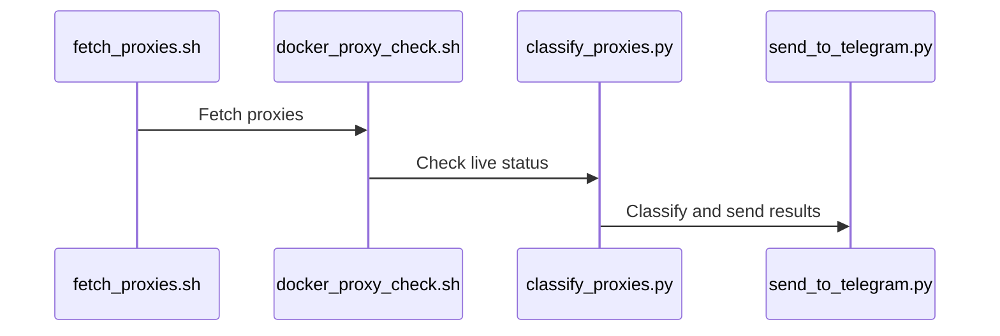
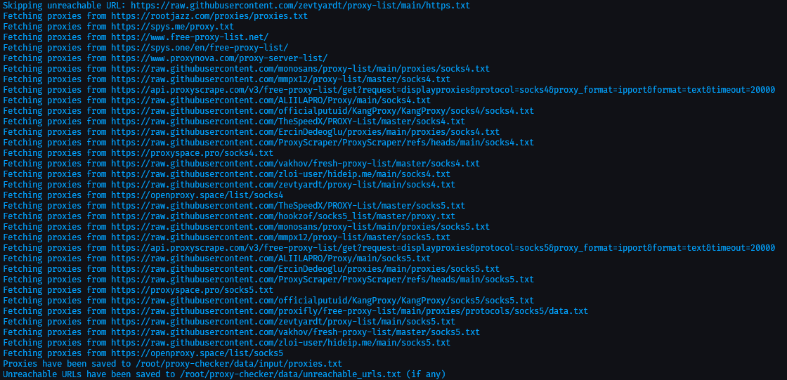

<h1 align="center">Proxy Checker User Guide 📌</h1>

## Index 📋
- [Index 📋](#index-)
- [Introduction 🚀](#introduction-)
- [Project Directory Structure 📁](#project-directory-structure-)
- [Summary and Workflow 🌐](#summary-and-workflow-)
  - [Overview Workflow](#overview-workflow)
  - [Workflow Diagram (Mermaid)](#workflow-diagram-mermaid)
  - [Project Setup 🛠️](#project-setup-️)
    - [Prerequisites 📦](#prerequisites-)
  - [Installation Steps ⚙️](#installation-steps-️)
    - [1. Clone the Repository](#1-clone-the-repository)
    - [2. Work with Virtual Environment (venv)](#2-work-with-virtual-environment-venv)
    - [3. Install Dependencies](#3-install-dependencies)
    - [4. Setting Up Environment Variables](#4-setting-up-environment-variables)
    - [5. Usage:](#5-usage)
  - [Conclusion 🏁](#conclusion-)

---

## Introduction 🚀
The **proxy-checker** project is an automated tool designed to help you validate and classify proxy servers from an input list. The process involves several scripts that work together sequentially, with each one focusing on a specific part of the proxy-checking workflow.

## Project Directory Structure 📁

Here is the structure of the **proxy-checker** project with additional explanations for each file and directory:

```bash
/proxy-checker
|-- .env                          # Environment variables file for configuration settings
|-- .gitignore                    # Files to be ignored by git (such as sensitive information or large data)
|-- data                          # Folder for storing input and output data
|   |-- geolite
|   |   -- GeoLite2-ASN.mmdb      # Database file used for ASN (Autonomous System Number) lookup
|   |-- input
|   |   -- proxies.txt            # Input file containing the list of proxies to be validated
|   -- output
|       -- live_proxies.txt       # Output file containing proxies that are found to be live after validation
|-- requirements.txt              # Python dependencies required to run the scripts
|-- pictures                      # Folder containing illustrative images
|   -- fetch_proxies.png          # Diagram showing the workflow of fetching proxies
|   -- check_proxies.png          # Diagram for the proxy-checking process
|   -- classify_proxies.png       # Diagram for classifying proxies
|   -- telegram_send.png          # Diagram for sending results to Telegram
-- scripts                        # Folder containing all project scripts
    |-- classify_proxies.py       # Python script to classify proxies into different categories based on various criteria
    |-- docker_proxy_check.sh     # Bash script to check the status of proxies using Docker and mubeng
    |-- fetch_proxies.sh          # Bash script to fetch proxies from a given URL
    |-- main.py                   # Main script for central control (optional)
    |-- run_scripts.sh            # Bash script to run all necessary scripts for the workflow in sequence
    |-- send_to_telegram.py       # Python script to send information about the proxies to Telegram channels
```

## Summary and Workflow 🌐

### Overview Workflow
1. **Fetch Proxies** (`fetch_proxies.sh`): Fetches a list of proxy servers from a provided URL and saves it to `proxies.txt`.
2. **Check Proxy Live Status** (`docker_proxy_check.sh`): Uses Docker and `mubeng` to check if the proxies are alive, saving the live proxies into `live_proxies.txt`.
3. **Classify Proxies** (`classify_proxies.py`): Classifies proxies based on categories such as residential, ASN, geographical region, and risk level. This script utilizes APIs like IPINFO and PROXYCHECK.
4. **Send Notification** (`send_to_telegram.py`): Sends classified proxy information to specified Telegram topics or channels.

### Workflow Diagram (Mermaid)

<div align="center">


</div>

### Project Setup 🛠️
#### Prerequisites 📦
You need to have the following installed on your system before starting:

- Python (>= 3.8) 🐍
- Docker 🐳
- git
- curl

### Installation Steps ⚙️
#### 1. Clone the Repository
Clone the project repository from GitHub:

```bash
git clone https://github.com/tamld/proxy-checker.git
cd proxy-checker
```

#### 2. Work with Virtual Environment (venv)
To keep dependencies isolated, create a virtual environment:

```bash
python -m venv venv
```

Activate the virtual environment:
Linux/Mac:
```bash
source venv/bin/activate
```

Windows:
```cmd
venv\Scripts\activate
```

#### 3. Install Dependencies
Use pip to install the necessary dependencies from requirements.txt:

```bash
pip install -r requirements.txt
```

#### 4. Setting Up Environment Variables
- To get the **Channel ID** and **Topic ID** for sending Telegram notifications:
   - Search for **@MissRose_bot** in Telegram.
   - Add it as an **administrator** to your channel or group.
   - Type `/id` in the channel or group.
   - @MissRose_bot will reply with the **Channel ID** and **Topic ID**.

- Get API [ipinfo.io](https://ipinfo.io/signup)
- Get API [proxychecker.io](https://proxycheck.io/)

Create a .env file to store the configuration variables, such as:
```text
# API Keys for third-party services
IPINFO_API_KEY=""  # API key for IPinfo.io to get information about IP addresses
PROXYCHECK_API_KEY=""  # API key for ProxyCheck.io to check proxy risk levels

# File paths for storing results and database files
BASE_PATH="/root/proxy-checker/data"  # Base path for all data files
PROXIES_FILE="${BASE_PATH}/input/proxies.txt"  # Path to the proxy list input file
LIVE_PROXIES_FILE="${BASE_PATH}/output/live_proxies.txt"  # Path to store the list of live proxies
CHECKED_PROXIES_FILE="${BASE_PATH}/output/checked_proxies.txt"  # Path to store the list of checked proxies
RESIDENTIAL_PROXIES_FILE="${BASE_PATH}/output/residential_proxies.txt"  # Path to store the list of residential proxies

# GeoLite2 Database Paths (Will be downloaded during execution)
BASE_URL="https://github.com/P3TERX/GeoLite.mmdb/raw/download"  # Base URL to download GeoLite2 databases
ASN_DB_URL="${BASE_URL}/GeoLite2-ASN.mmdb"  # URL for downloading ASN database
ASN_DB_PATH="${BASE_PATH}/geolite/GeoLite2-ASN.mmdb"  # Path to the ASN database


# Telegram Bot Token for notifications (Optional)
TELEGRAM_BOT_TOKEN=""  # Telegram bot token for sending messages (leave empty if not used)
TELEGRAM_CHANNEL="" # Telegram Channel. Start with -
TELEGRAM_RES_TOPIC=""  # Topic ID for Residential Proxies
TELEGRAM_CHECKED_TOPIC=""  # Topic ID for Checked Proxies
```

#### 5. Usage:

```bash
chmod +x ./scripts/run_scripts.sh
./scripts/run_scripts.sh
```

This will execute the following:
- Fetch proxies.


- Check their live status.


- Classify them.


- Send the results via Telegram.


### Conclusion 🏁
The proxy-checker project automates the validation, classification, and notification of proxy information. By following this guide, you can set up the environment, run each script individually, or automate the entire process.

Feel free to extend the project by adding more sources, integrating new API services, or refining the classification process.